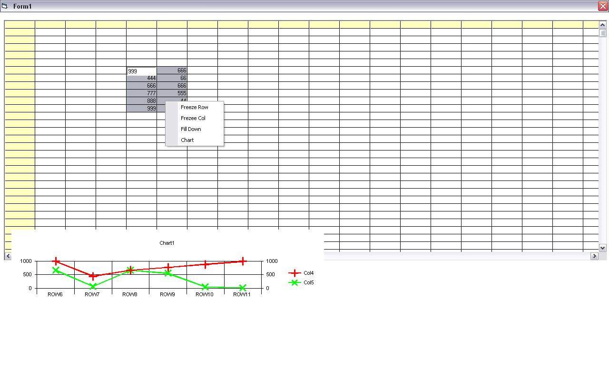



## EXCEL like flexgrid

### Description

This code able to perform excel like enviroment from a flexgrid , it consist of fill down , freeze column ,freeze row and chart function ;

the code are neat and easily understand,
 
### More Info
 
KIndly contact me that i need you input to enhance the functionality..

             |
---                |---
**Submitted On**   |2007-04-05 17:59:04
**By**             |[Yong Yung](https://github.com/Planet-Source-Code/PSCIndex/blob/master/ByAuthor/yong-yung.md)
**Level**          |Advanced
**User Rating**    |4.5 (27 globes from 6 users)
**Compatibility**  |VB 5\.0, VB 6\.0
**Category**       |[VB function enhancement](https://github.com/Planet-Source-Code/PSCIndex/blob/master/ByCategory/vb-function-enhancement__1-25.md)
**World**          |[Visual Basic](https://github.com/Planet-Source-Code/PSCIndex/blob/master/ByWorld/visual-basic.md)
**Archive File**   |[EXCEL\_like2080408212007\.zip](https://github.com/Planet-Source-Code/yong-yung-excel-like-flexgrid__1-69196/archive/master.zip)

